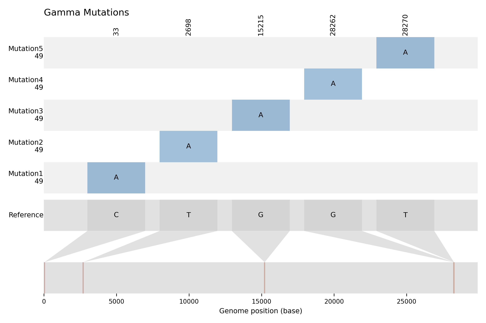

# Basic usage

Welcome to the GRAMEP "Basic Usage" handbook. This section provides a starting point for users who are new to GRAMEP or need a refresher on its key features and functionality. You'll find step-by-step instructions, clear examples, and best practices to help you get started with GRAMEP. This tutorial will give you with the information and skills to properly use GRAMEP for your unique needs, whether you are a beginner discovering the software for the first time or an experienced user looking for a quick reference.



!!! note "About this handbook"
    This tutorial provides several examples. While executing the commands, you may encounter slight differences in the output due to potential updates to the program or files. However, these variations will not impact the program's functionality.

## Commands

GRAMEP is a multi-purpose Command Line Interface (CLI) software for genomics analysis. It provides a variety of sophisticated tools packaged in subcommands, allowing users to efficiently execute specified tasks. The following subcommands are provided to enable various genomics capabilities:

`get-mutations`: Perform k-mer analysis and generate optional reports.  
`get-intersection`: Find intersections between variants in your data.  
`classify`: Use this command for variant classification.  
`predict`: Make predictions on variants.  
`from-configfile`: Execute GRAMEP based on configurations from a file.  
`grid-search`: Perform grid search to suggest a value for `word` and `step` size.  
`phylogenetic`: Perform phylogenetic analysis.  

Each subcommand caters to a specific task, empowering you to customize your genomics analysis precisely to your needs. Dive into these subcommands to unlock the full potential of GRAMEP and elevate your research and analysis workflows.

### Accessing Tutorial Files

To follow this short tutorial on using the GRAMEP method, you'll need specific files relevant to your analysis. If you already have these files, you can use your local copies. However, if you don't have the required files or want to ensure you have the most up-to-date versions, we recommend downloading them from our official repository.

Download the Tutorial Files: [Download Link](https://github.com/omatheuspimenta/GRAMEP/raw/main/data/tutorial_data.tar.xz)

Simply click on the download link provided above to access the necessary files. Once downloaded, you'll be ready to start the tutorial and explore the capabilities of GRAMEP for genomics analysis.

In this tutorial, we downloaded and saved the data in a folder named `tutorial_data`, which includes three subfolders: `VOCs`, `reference`, and `reference_annotation`.

The `VOCs` folder contains variant sequences in .FASTA format.  
The `reference` folder houses the SARS-CoV-2 virus's reference sequence obtained from [NCBI](https://www.ncbi.nlm.nih.gov/nuccore/NC_045512.2).  
The `reference_annotation` folder holds the .gff3 file containing annotations for the SARS-CoV-2 genome.

### Identifying most informative SNPs with 'get-mutations'

The `get-mutations` command in GRAMEP plays a crucial role in identifying the most informative Single Nucleotide Polymorphisms (SNPs) for a specific lineage of the analyzed organism. This step applies the principle of maximum entropy to select SNPs that provide the highest information content. Because it is based on the maximum entropy principle, it is strongly recommended that a considerable amount of input data be provided for optimal results.

To configure the `get-mutations` command according to your analysis needs, you can access its parameters and options by using the `--help` flag. This command provides a detailed list of available settings and instructions on how to use them effectively. Simply execute the following command in your terminal:

<!-- termynal -->

```
$ gramep get-mutations --help
```

This will display all the parameters and options that you can use to fine-tune the `get-mutations` command, allowing you to perform precise SNP identification for your genomics analysis.



The parameters identified as `required` are essential and must be provided for the method's successful execution. Among these, `word` and `step` parameters play a crucial role in conducting an in-depth analysis of the most informative SNPs.

The `word` parameter is especially useful for identifying areas of interest within the investigation. The `step` parameter, on the other hand, sets the size of the sliding window and whether overlap between the k-mers derived from each sequence is required.

By utilizing the previously provided downloadable data, we can proceed to run an example aimed at identifying the most informative SNPs for a specific SARS-CoV-2 variant.

!!! info "`--save-path` parameter"
    We strongly recommend saving the results of your `get-mutations` command to a dedicated folder. Specifically, we suggest including the `/mutations/` folder as part of the saving directory.


<div class="termy" data-termynal data-ty-macos data-ty-title="shell"><span data-ty="input" data-ty-prompt="$">gramep get-mutations --rpath tutorial_data/reference/SARS-CoV2_wuhan_refseq.fasta \
--spath tutorial_data/VOCs/Gamma.fasta \
--apath tutorial_data/reference_annotation/GCF_009858895.2_ASM985889v3_genomic.gff \
--save-path tutorial_data/output/mutations/ \
--word 10 \
--step 1 \
--create-report \
--save-kmers</span><span data-ty>INFO     🏁 Starting getMutations method                                                                                  
INFO     ⌛ Loading kmers from sequences                                                                                  
⠙  Buffering the sequences ... ━━━━━━━━━━━━━━━━━━━━━━━━━━━━━━━━━━━━━━━━ 50/? 0:00:01 <  
⠋  Buffering the sequences ... ━━━━━━━━━━━━━━━━━━━━━━━━━━━━━━━━━━━━━━━━ 1/? 0:00:00 <  
INFO     🏁 Starting...                                                                                                   
  100% Loading sequences ... ━━━━━━━━━━━━━━━━━━━━━━━━━━━━━━━━━━━━━━━━ 50/50 0:00:00 < 0:00:00
INFO     🤖📊 Entropy analysis                                                                                            
INFO     🏁 Starting...                                                                                                   
  100% Loading reference sequence ... ━━━━━━━━━━━━━━━━━━━━━━━━━━━━━━━━━━━━━━━━ 1/1 0:00:00 < 0:00:00
INFO     ✅📁 Exclusive kmers saved in tutorial_data/output//Gamma folder                                            
INFO     🔎 Getting information about exclusive kmers...                                                                  
  100% Getting SNPs positions ... ━━━━━━━━━━━━━━━━━━━━━━━━━━━━━━━━━━━━━━━━ 50/50 0:00:00 < 0:00:00
  100% Creating report ... ━━━━━━━━━━━━━━━━━━━━━━━━━━━━━━━━━━━━━━━━ 49/49 0:00:00 < 0:00:00
INFO     ✅📁 Exclusive kmers saved in tutorial_data/output//Gamma folder                                            
INFO     ✅📁 Report saved in tutorial_data/output//Gamma folder                                                     
INFO     ✅📁 Frequencies saved in tutorial_data/output//Gamma folder                                                
INFO     ✅📁 Graphic saved in tutorial_data/output/ folder                                                          
INFO     Done! 💥🎉✨                                                                                                               <br></span></div>

In the example provided, we executed the analysis specifically for the Gamma variant. We configured the `word` and `step` parameters to values 10 and 1, respectively. Additionally, we instructed the program to generate a comprehensive report, which includes the following information for each sequence:

* Sequence ID  
* Region name where the mutation occurred  
* Start and end positions of that region in the genome  
* Region type  
* Mutation location in the reference  
* K-mer found in both the reference and the variant  
* The nitrogenous base change from the reference to the analyzed variant

Furthermore, we saved the most informative k-mers exclusive to the Gamma variant. This detailed report and the exclusive k-mers are saved in `tutorial_data/output/` folder.

!!! tip "Multiple variants analysis"
    If you need to run the method on various variants of the same organism, you can create a shell script to automate the execution for different variants.

Within the `/tutorial_data/output` directory, a dedicated folder is automatically created for each variant, named after the input FASTA file used. Inside each variant's folder, you will find the following essential files and resources:

* **Exclusive K-mers**: These are available in both binary format (.sav) and plain text format (.txt), providing valuable genetic insights.

Example of .txt:
```TEXT
['AACAAACAAA', 'ACAAACAAAC']
```

* **Mutation Frequency Table**: A CSV file (.csv) containing the frequency of each mutation occurrence in the input data.

Example of frequency table file:
```CSV
position;reference_value;variant_value;frequency
28262;G;A;49
33;C;A;49
28270;T;A;49
2698;T;A;49
15215;G;A;49
```

* **FASTA of variant mutation**: A .FASTA file detailing mutations identified in the variant compared to the reference sequence.  

* **Report (Optional)**: If requested, a CSV file (.csv) that provides detailed information about the analysis.

First lines of the report generated in .csv format:
```CSV
sequence_id;annotation_name;start;end;type;modification_localization_in_reference;reference_kmer;exclusive_variant_kmer;reference_snp;variant_snp
OM245115.1;NO_ANNOTATIONS_AVAILABLE;NO_ANNOTATIONS_AVAILABLE;NO_ANNOTATIONS_AVAILABLE;NO_ANNOTATIONS_AVAILABLE;33;AACAAACCAA;AACAAACAAA;C;A
OM245115.1;ORF1ab;266;21555;gene;15215;AACAAGCAAA;AACAAACAAA;G;A
OM245115.1;NO_ANNOTATIONS_AVAILABLE;NO_ANNOTATIONS_AVAILABLE;NO_ANNOTATIONS_AVAILABLE;NO_ANNOTATIONS_AVAILABLE;28262;AACGAACAAA;AACAAACAAA;G;A
OM245115.1;ORF1ab;266;21555;gene;2698;AACAAACAAT;AACAAACAAA;T;A
```

* **Mutations Data**: The mutations detected in both binary format (.sav) and plain text format (.txt).

Example of .txt:
```TEXT
['28262:GA', '28270:TA', '33:CA', '15215:GA', '2698:TA']
```

* **BED**: The variations in .bed3 format.

* **Graphical Representation**: A PDF file (.pdf) illustrating the positions of identified mutations for visual clarity.

Example of graphical representation:
{width="800" .center}
The y-axis of the graph represents the mutations, with the frequency of occurrence displayed just below each mutation label. Meanwhile, the x-axis corresponds to the reference genome.

#### Execution in Cases with Pre-existing Files of Exclusive K-mers

If you already possess a file containing the most informative exclusive k-mers, you can effortlessly execute the GRAMEP method by specifying during the execution call that this file will be used.

!!! warning "File containing the exclusive k-mers"
    The file containing the exclusive k-mers must either be the previously generated binary file in .sav format or a file with each k-mer on a separate line. **It is crucial to ensure that all k-mers in the file have the same size**, meaning they consist of the same number of characters.

!!! note "TODO: accept different size kmers"
    In the upcoming update, GRAMEP will offer the capability to provide k-mers of different sizes.


In this scenario, when making the call, the `word` parameter should denote the size of the provided k-mers, and `step` should indicate the step size for the sliding window.

To demonstrate this scenario, we will use a .txt file named `gamma_exclusive_kmers.txt`, which contains exclusive k-mers obtained previously. The content of this file, located in the `/tutorial_data/` folder, includes:

```TEXT
AAAAAACAAA
ACAAACAAAC
```
This example serves to illustrate the method's execution when utilizing pre-existing k-mer files, in this case, from `gamma_exclusive_kmers.txt`.

<div class="termy" data-termynal data-ty-macos data-ty-title="shell"><span data-ty="input" data-ty-prompt="$">gramep get-mutations --rpath tutorial_data/reference/SARS-CoV2_wuhan_refseq.fasta \
--spath tutorial_data/VOCs/Gamma.fasta \
--apath tutorial_data/reference_annotation/GCF_009858895.2_ASM985889v3_genomic.gff \
--save-path tutorial_data/output/ \
--word 10 \
--step 1 \
--create-report \
--load-exclusive-kmers \
--exclusive-kmers tutorial_data/gamma_exclusive_kmers.txt</span><span data-ty>INFO     🏁 Starting getMutations method                                                                                  
INFO     ⌛ Loading kmers from sequences                                                                                  
⠙  Buffering the sequences ... ━━━━━━━━━━━━━━━━━━━━━━━━━━━━━━━━━━━━━━━━ 50/? 0:00:01 <  
⠋  Buffering the sequences ... ━━━━━━━━━━━━━━━━━━━━━━━━━━━━━━━━━━━━━━━━ 1/? 0:00:00 <  
INFO     ✅📂 kmers file loaded                                                                                           
INFO     🔎 Getting information about exclusive kmers...                                                                  
  100% Getting SNPs positions ... ━━━━━━━━━━━━━━━━━━━━━━━━━━━━━━━━━━━━━━━━ 50/50 0:00:00 < 0:00:00
  100% Creating report ... ━━━━━━━━━━━━━━━━━━━━━━━━━━━━━━━━━━━━━━━━ 49/49 0:00:00 < 0:00:00
INFO     ✅📁 Report saved in tutorial_data/output//Gamma folder                                                     
INFO     ✅📁 Frequencies saved in tutorial_data/output//Gamma folder                                                
INFO     ✅📁 Graphic saved in tutorial_data/output/ folder                                                          
INFO     Done! 💥🎉✨                                                                                                                                                                                                                    <br></span></div>

The command output follows the same format as previously explained.

### Identifying Shared Mutations Between Variants with `get-intersection`

Once you have executed the `get-mutations` command for multiple variants, you might want to determine which mutations are common among these analyzed variants. In such cases, the `get-intersection` command is employed.

To access the available options and obtain help for this command, simply include the `--help` flag in your execution call.

<div class="termy" data-termynal data-ty-macos data-ty-title="shell"><span data-ty="input" data-ty-prompt="$">gramep get-intersection --help</span><span data-ty><br>Usage: gramep get-intersection [OPTIONS]                                                                                 
                                                                                                                          
 Get intersection between variants.                                                                                       
                                                                                                                          
╭─ Options ──────────────────────────────────────────────────────────────────────────────────────────────────────────────╮
│ *  --save-path                              TEXT  📂 Folder where the results obtained through the get-mutations       │
│                                                   subcommand were saved.                                               │
│                                                   [default: None]                                                      │
│                                                   [required]                                                           │
│    --intersection-seletion  -selection      TEXT  ✔ Select intersection type. To specify the variants for              │
│                                                   intersection, provide them separated by '-'. For example:            │
│                                                   'variant1-variant2-variant3'.                                        │
│                                                   [default: ALL]                                                       │
│    --help                                         Show this message and exit.                                          │
╰────────────────────────────────────────────────────────────────────────────────────────────────────────────────────────╯
<br></span></div>

To perform the most basic analysis with the `get-intersection` subcommand, you need to specify the following parameters:

|Parameter| Type | Description|
| --------| -----| -----------|
| --save-path | Text | :open_file_folder: Folder where the results obtained through the `get-mutations` subcommand were saved. **Is required**.|
| --intersection-seletion | Text | :heavy_check_mark: Select intersection type. To specify the variants for intersection, provide them separated by `-`. For example: 'variant1-variant2-variant3'. |

!!! warning "Multiple variants intersection"
    It's important to note that performing intersection analysis between multiple variants can be computationally intensive and time-consuming.

In this scenario, let's consider the `/tutorial_data/output/` folder, which contains the output generated by the `get-mutations` command for all variants. If you haven't executed the `get-mutations` command for all variants and wish to do so, please refer to the previous section.

By default, the `--intersection-selection` parameter performs the intersection analysis among all variants located in the folder specified by the `--save-path` parameter. However, it is also possible to selectively choose specific variants for intersection analysis. To achieve this, simply list the desired variants separated by hyphens, as indicated in the command's help documentation.

<div class="termy" data-termynal data-ty-macos data-ty-title="shell"><span data-ty="input" data-ty-prompt="$">gramep get-intersection --save-path tutorial_data/output/</span><span data-ty>INFO     🏁 Starting get_variants_intersection method                                                                     
INFO     ✅📁 Intersections saved in tutorial_data/output//intersections.txt folder                                                
INFO     Done! 💥🎉✨                                                                                                     <br></span></div>

The file containing the intersections of mutations between variants will be stored in the directory specified by the `--save-path` parameter. Below, you can find the file generated by the previously executed command.

```TEXT
Beta-Delta: 241:CT, 8861:GC, 203:CT, 20173:GT
Beta-Alpha: 241:CT, 8861:GC, 203:CT, 20173:GT
Delta-Alpha: 241:CT, 8861:GC, 203:CT, 20173:GT
Beta-Delta-Alpha: 241:CT, 8861:GC, 203:CT, 20173:GT
```

### Getting a basic phylogeny with `phylogenetic`

After extracting mutations from each variant, you can generate a phylogeny using the `phylogenetic` command. For comprehensive details on available options and usage, use the `--help` flag.

<div class="termy" data-termynal data-ty-macos data-ty-title="shell"><span data-ty="input" data-ty-prompt="$">gramep phylogenetic --help</span><span data-ty>    
Usage: gramep phylogenetic [OPTIONS]                                                                                                                                                         
                                                                                                                                                                                              
 Perform phylogenetic analysis.                                                                                                                                                               
                                                                                                                                                                                              
╭─ Options ──────────────────────────────────────────────────────────────────────────────────────────────────────────────────────────────────────────────────────────────────────────────────╮
│ *  --save-path           TEXT  📂 Folder where the results of the analyses performed by the get-mutations command are saved. [default: None] [required]                                    │
│    --save-heatmap              💾🔥🗺 Save heatmap of the distance matrix.                                                                                                                  │
│    --help                      Show this message and exit.                                                                                                                                 │
╰────────────────────────────────────────────────────────────────────────────────────────────────────────────────────────────────────────────────────────────────────────────────────────────╯

 <br></span></div>

 The only required parameter is `--save-path`, which specifies the location of the mutations identified for each variant using the `get-mutations` command. Adding the `--save-heatmap` flag generates a heatmap visualization, but this option requires additional processing time and memory usage.

To execute the `phylogenetic` command for the data that was previously obtained, simply enter the following command in your terminal:

<div class="termy" data-termynal data-ty-macos data-ty-title="shell"><span data-ty="input" data-ty-prompt="$"> gramep phylogenetic --save-path tutorial_data/output/mutations/ </span><span data-ty>
INFO     🏁 Starting phylogenics tree construction method ...                                                                                                                                 
  100% Loading reports files ... ━━━━━━━━━━━━━━━━━━━━━━━━━━━━━━━━━━━━━━━━ 5/5 0:00:01 < 0:00:00
INFO      Creating distance matrix and linkage ...                                                                                                                                            
INFO     ✅📁 Newick file saved in data/output/phylogenics/ folder                                                                                              
INFO     ✅🌲 Phylogenic tree saved in data/output/phylogenics/ folder                                                                                          
INFO     Done! 💥🎉✨      
 <br></span></div>

One file`.tree` extension containing the tree in Newick format is generated. Using the generated Newick file, you have the flexibility to style the tree with various layouts.

### Training a Classification Model with `classify`

The process of training and validating a prediction model is accomplished using the `classify` command. To access additional information about this command and its options, simply include the `--help` flag when using it.

<div class="termy" data-termynal data-ty-macos data-ty-title="shell"><span data-ty="input" data-ty-prompt="$">gramep classify --help</span><span data-ty>                                                                                                                           
 Usage: gramep classify [OPTIONS]                                                                                         
                                                                                                                          
 Classify variants.                                                                                                       
                                                                                                                          
╭─ Options ──────────────────────────────────────────────────────────────────────────────────────────────────────────────╮
│ *  --word                          -w          INTEGER  📝 Word size. [default: None] [required]                       │
│ *  --step                          -s          INTEGER  ⏭ Step size. [default: None] [required]                        │
│ *  --save-path                                 TEXT     📂 Path to save results. [default: None] [required]            │
│ *  --dir-path                      -dpath      TEXT     📂 Path to directory containing variants. [default: None]      │
│                                                         [required]                                                     │
│    --dictonary                     -d          TEXT     🧬📖 DNA dictionary. [default: ACTG]                           │
│    --should-save-data                                   💾 Save data used for classification. [default: True]          │
│    --should-save-model                                  💾 Save model used for classification. [default: True]         │
│    --should-save-confusion-matrix                       💾🟥🟦 Save confusion matrix. [default: True]                  │
│    --help                                               Show this message and exit.                                    │
╰────────────────────────────────────────────────────────────────────────────────────────────────────────────────────────╯
 <br></span></div>

The `classify` subcommand of GRAMEP is used to train classification model to classify biological sequences.

The input parameters for the model are analogous to those discussed previously. The key difference lies in the use of the `--save-path` parameter, which specifies the directory containing folders with results for each variant obtained from the `get-mutations` command. 

During the model training stage, feature extraction is performed using the most informative k-mers unique to each previously analyzed variant. The `dir-path` parameter specifies the directory where the sequences, used for training the model, are located. For each variant, this directory must contain a .fasta file named after the variant.

Additionally, the feature matrix obtained from feature extraction for each sequence in the training dataset is automatically saved by default. If you prefer not to save this data, you can include the `--should-save-data` flag. Similarly, you can use the `--should-save-model` flag to prevent automatic saving of the trained model and the `--should-save-confusion-matrix` flag to disable automatic saving of the confusion matrix obtained during model validation. By default, all information is saved.

!!! info "k-mers length"
    As of the current version, it's required that all unique most informative k-mers share the same size, and this size must be specified using the `word` parameter. However, in future updates, this restriction will be lifted, allowing the use of k-mers with different sizes. Stay tuned for these upcoming enhancements.

To execute the `classify` command for the data that was previously obtained, simply enter the following command in your terminal:

<div class="termy" data-termynal data-ty-macos data-ty-title="shell"><span data-ty="input" data-ty-prompt="$">gramep classify -w 10 -s 1 \
--save-path tutorial_data/output \
--dir-path tutorial_data/VOCs/ \
-d ACTG</span><span data-ty>INFO     🏁 Starting Extracting the features ...                                                                                                                                              
  100% Loading sequences ... ━━━━━━━━━━━━━━━━━━━━━━━━━━━━━━━━━━━━━━━━ 1100/1100 0:00:04 < 0:00:00
INFO     Processing dataframe                                                                                                                                                                 
INFO     ✅📁 Dataframe saved in tutorial_data/VOCs/classify/results folder                                                                                   
INFO     ✅📁 Ranges saved in tutorial_data/VOCs/classify/model folder                                                                                        
INFO     🌲🌳 Classifying the sequences using Random Forest with default parameters                                                                                                           
INFO     ✅📁 Model saved in tutorial_data/VOCs/classify/model folder                                                                                         
RESULT   🎯 Mean accuracy - 10 repeated 10 fold Cross Validate:0.9981818181818182                                                                                                             
RESULT   🎯 Accuracy:1.0                                                                                                                                                                      
RESULT   📊 Metrics                                                                                                                                                                           
                       precision    recall  f1-score   support                                                                                                                                
                                                                                                                                                                                              
                Alpha       1.00      1.00      1.00        44                                                                                                                                
                 Beta       1.00      1.00      1.00        44                                                                                                                                
                Delta       1.00      1.00      1.00        44                                                                                                                                
                Gamma       1.00      1.00      1.00        44                                                                                                                                
              Omicron       1.00      1.00      1.00        44                                                                                                                                
                                                                                                                                                                                              
             accuracy                           1.00       220                                                                                                                                
            macro avg       1.00      1.00      1.00       220                                                                                                                                
         weighted avg       1.00      1.00      1.00       220                                                                                                                                
                                                                                                                                                                                              
INFO     ✅📁 Metrics saved in tutorial_data/VOCs/classify/results folder                                                                                     
INFO     🟥🟦Confusion matrix saved in tutorial_data/VOCs/classify/results folder                                                                             
INFO     Done! 💥🎉✨                                                                                                             <br></span></div>

!!! danger Important Notice - Results and Model usage
    The results obtained in this tutorial are solely for the purpose of **demonstrating the package**. The model presented here is a *toy model* and should not be employed for analytics or production use. For genuine analysis and production scenarios, it's **imperative to train a new model using real data and a larger dataset**. Please refrain from using this model beyond the scope of this tutorial.

Inside the `tutorial_data/` folder, you will find a new folder `classify` with two new directories: `model`, which houses the binaries files related to the trained model, and `results`, which contains files pertaining to the model's validation. These validation files include the confusion matrix (`confusion_matrix.png`), text-formatted metrics (`metrics.txt`), and the feature matrix (`dataframe.csv`).

### Predicting classes for new sequences with `predict`

After you've trained and validated a classification model with the classify command, you can use the predict command to make predictions on fresh sequences. Simply include the `--help` flag when running the command for further information and guidance.

<div class="termy" data-termynal data-ty-macos data-ty-title="shell"><span data-ty="input" data-ty-prompt="$">gramep predict --help</span><span data-ty>                                                                                                                           
 Usage: gramep predict [OPTIONS]                                                                                          
                                                                                                                          
 Predict variants.                                                                                                        
                                                                                                                          
╭─ Options ──────────────────────────────────────────────────────────────────────────────────────────────────────────────╮
│ *  --word              -w             INTEGER  📝 Word size. [default: None] [required]                                │
│ *  --step              -s             INTEGER  ⏭ Step size. [default: None] [required]                                 │
│ *  --save-path                        TEXT     📂 Path to save results. [default: None] [required]                     │
│ *  --predict-seq-path  -pseqpath      TEXT     📂 Path to sequences to be predicted. [default: None] [required]        │
│ *  --dir-path          -dpath         TEXT     📂 Path to directory containing the files. [default: None] [required]   │
│ *  --dict              -d             TEXT     🧬📖 DNA dictionary. [default: None] [required]                         │
│ *  --load-ranges-path  -lrpath        TEXT     📂 Path to ranges file. [default: None] [required]                      │
│ *  --load-model-path   -lmpath        TEXT     📂 Path to model file. [default: None] [required]                       │
│    --help                                      Show this message and exit.                                             │
╰────────────────────────────────────────────────────────────────────────────────────────────────────────────────────────╯ <br></span></div>

By using the `predict` command, you can apply your trained model to make accurate class predictions on new biological sequences.

It's crucial to ensure that the `word` and `step` parameters match the values used during the training stage of the classification model. This consistency is essential for accurate predictions. To get a better understanding of how the `predict` command works, let's apply it to an example file. 

<div class="termy" data-termynal data-ty-macos data-ty-title="shell"><span data-ty="input" data-ty-prompt="$">gramep predict -w 10 -s 1 \
--save-path tutorial_data/output \
-pseqpath tutorial_data/VOCs/Omicron.fasta \
--dir-path tutorial_data/VOCs/ \
-d ACTG \
-lrpath tutorial_data/VOCs/model/ranges.sav \
-lmpath tutorial_data/VOCs/model/model.sav</span><span data-ty> INFO     💬 Prediction start...                                                                                           
  100% Loading sequences ... ━━━━━━━━━━━━━━━━━━━━━━━━━━━━━━━━━━━━━━━━ 50/50 0:00:01 < 0:00:00
INFO     Done! 💥🎉✨                                                                                                     
INFO     ✅📁 Predictions saved in tutorial_data/VOCs/ folder                                                         <br></span></div>

After executing the command, a file named `predict_data.csv` will be generated within the directory specified by the `--dir-path` parameter. This file will contain the ID and predicted class for each sequence provided via the `-pseqpath` parameter.

First lines of the `predict_data.csv` generated:
```CSV
ID,Predicted
OM310688.1,Omicron
OM294815.1,Omicron
OM294926.1,Omicron
OM295048.1,Omicron
OM295263.1,Omicron
```

### Executing GRAMEP Using a Configuration File with `from-configfile`

In certain scenarios, it becomes necessary to use a configuration file that contains all the parameters and configurations for GRAMEP. This approach allows for streamlined execution by specifying only the desired objectives.

To execute GRAMEP using a configuration file, you can utilize the `from-configfile` command. This command is designed to read the parameters and settings from the provided configuration file, streamlining the execution process.

To explore the available options and learn how to use the `from-configfile` command effectively, you can use the `--help` flag. This command returns comprehensive help information, guiding you through the steps of executing GRAMEP using a configuration file.

<div class="termy" data-termynal data-ty-macos data-ty-title="shell"><span data-ty="input" data-ty-prompt="$">gramep from-configfile --help</span><span data-ty>                                                                                                                          
 Usage: gramep from-configfile [OPTIONS]                                                                                  
                                                                                                                          
 Execute GRAMEP from a config file.                                                                                       
                                                                                                                          
╭─ Options ──────────────────────────────────────────────────────────────────────────────────────────────────────────────╮
│ *  --objective    -o      TEXT  📝 Objective. Options: get-mutations, get-intersection, classify, predict.             │
│                                 [default: None]                                                                        │
│                                 [required]                                                                             │
│ *  --config-file  -c      TEXT  📂 Path to config file. [default: None] [required]                                     │
│    --help                       Show this message and exit.                                                            │
╰────────────────────────────────────────────────────────────────────────────────────────────────────────────────────────╯
<br></span></div>

The descriptions of the parameters are provided below. The `--objective` parameter accepts one of the following inputs: `get-mutations`, `get-intersection`, `classify`, or `predict`.

|Parameter| Type | Description|
| --------| -----| -----------|
|-o | Text | 📝 Objective. Options: get-mutations, get-intersection, classify, predict.|
|-c | Text | 📂 Path to config file. [default: None] |

The configuration file for GRAMEP follows a standardized structure, ensuring consistency and ease of use. It must contain specific variables for each objective, organized into distinct groups. These groups help categorize the parameters required for different GRAMEP commands, streamlining the configuration process.

Here are the key groups within the configuration file:

- `[mutations]`: This group encompasses parameters essential for executing the`get-mutations` command.
- `[intersection]`: The parameters required for the `get-intersection` command are contained within this group.
- `[classify]`: For executing the `classify` command, you'll find the necessary parameters in this group.
- `[predict]`: The `predict` command's mandatory parameters are listed within this group.
- `[phylogenic]`: The parameters required for the `phylogenic` command are contained within this group.

To illustrate this configuration structure, we provide a complete example of a configuration file. You can open the exact file from the `tutorial_data` folder.

This standardized format simplifies the setup process and ensures that all required parameters are appropriately organized for each specific objective.

```INI
[mutations]
# Reference path
reference_path = tutorial_data/reference/SARS-CoV2_wuhan_refseq.fasta
# Sequence path
sequence_path = tutorial_data/VOCs/Delta.fasta
# Annotation path
annotation_path = tutorial_data/reference_annotation/GCF_009858895.2_ASM985889v3_genomic.gff
# Save path
save_path = tutorial_data/output/
# Word size
word = 10
# Step size
step = 1
# Max SNPs allowed
snps_max = 1
# dictonary (ACTG/ACGU)
dictonary = ACTG
# Create report
create_report = True
# Save Exclusive kmers
save_kmers = True
# Load Exclusive kmers
load_exclusive_kmers = False
# Path Exclusive kmers
path_exclusive_kmers = None
# Chunk size
chunk_size = 100

[intersection]
# Save path
save_path = tutorial_data/output/
# Intersection Seletion (Use the name of the variants separated by - or 'ALL' option)
intersection_seletion = ALL

[classify]
# Word size
word = 10
# Step size
step = 1
# Save path
save_path = tutorial_data/output/
# Dir path
dir_path = tutorial_data/VOCs/
# dictonary (ACTG/ACGU)
dictonary = ACTG
# Save data
should_save_data = True
# Save model
should_save_model = True
# Save confusion matrix
should_save_confusion_matrix = True

[predict]
# Word size
word = 10
# Step size
step = 1
# Save path
save_path = tutorial_data/output/
# Predict sequence path
predict_seq_path = tutorial_data/VOCs/Omicron.fasta
# Dir path
dir_path = tutorial_data/VOCs/
# dictonary (ACTG/ACGU)
dictonary = ACTG
# Load ranges path
load_ranges_path = tutorial_data/VOCs/model/ranges.sav
# Load model path
load_model_path = tutorial_data/VOCs/model/model.sav

[phylogenic]
# Save path
save_path = data/output/mutations/
# Save model
save_heatmap = False
```

After completing the configuration file with the necessary parameters, executing the command becomes straightforward. Simply specify the desired objective and provide the location of the configuration file when invoking the `from-configfile` command.

<div class="termy" data-termynal data-ty-macos data-ty-title="shell"><span data-ty="input" data-ty-prompt="$">gramep from-configfile -o get-mutations -c tutorial_data/parameters.ini</span><span data-ty>INFO     🏁 Starting getMutations method                                                                                  
INFO     ⌛ Loading kmers from sequences                                                                                  
⠙  Buffering the sequences ... ━━━━━━━━━━━━━━━━━━━━━━━━━━━━━━━━━━━━━━━━ 50/? 0:00:01 <  
⠋  Buffering the sequences ... ━━━━━━━━━━━━━━━━━━━━━━━━━━━━━━━━━━━━━━━━ 1/? 0:00:00 <  
INFO     🏁 Starting...                                                                                                   
  100% Loading sequences ... ━━━━━━━━━━━━━━━━━━━━━━━━━━━━━━━━━━━━━━━━ 50/50 0:00:00 < 0:00:00
INFO     🤖📊 Entropy analysis                                                                                            
INFO     🏁 Starting...                                                                                                   
  100% Loading reference sequence ... ━━━━━━━━━━━━━━━━━━━━━━━━━━━━━━━━━━━━━━━━ 1/1 0:00:00 < 0:00:00
INFO     ✅📁 Exclusive kmers saved in tutorial_data/output//Delta folder                                                          
INFO     🔎 Getting information about exclusive kmers...                                                                  
  100% Getting SNPs positions ... ━━━━━━━━━━━━━━━━━━━━━━━━━━━━━━━━━━━━━━━━ 50/50 0:00:00 < 0:00:00
  100% Creating report ... ━━━━━━━━━━━━━━━━━━━━━━━━━━━━━━━━━━━━━━━━ 50/50 0:00:00 < 0:00:00
INFO     ✅📁 Exclusive kmers saved in tutorial_data/output//Delta folder                                                          
INFO     ✅📁 Report saved in tutorial_data/output//Delta folder                                                                   
INFO     ✅📁 Frequencies saved in tutorial_data/output//Delta folder                                                              
INFO     ✅📁 Graphic saved in tutorial_data/output/ folder                                                                        
INFO     Done! 💥🎉✨                                                                                                     <br></span></div>

For each command specified using the `--objective` parameter, it will be executed following the procedures outlined in the preceding sections.

### Getting suggested values for `word` and `step` parameters using `grid-search`

One way to obtain **suggested** values for the `word` and `step` parameters is to use the `grid-search` command.

!!! warning "`word` and `step` values"
    The values chosen for `word` and `step` significantly influence the obtained results. These parameters can impact the coverage of mutations and may contribute to the occurrence of false positive mutations.

For comprehensive details on available options and usage, use the `--help` flag.

<div class="termy" data-termynal data-ty-macos data-ty-title="shell"><span data-ty="input" data-ty-prompt="$"> gramep grid-search --help </span><span data-ty>
Usage: gramep grid-search [OPTIONS]                                                                                                                                                          
                                                                                                                                                                                              
 Perform grid search to suggest a value for word and step size.                                                                                                                               
                                                                                                                                                                                              
╭─ Options ──────────────────────────────────────────────────────────────────────────────────────────────────────────────────────────────────────────────────────────────────────────────────╮
│ *  --rpath                 TEXT     📂 Path to reference sequence. [default: None] [required]                                                                                              │
│ *  --spath                 TEXT     📂 Path to sequence. [default: None] [required]                                                                                                        │
│ *  --min-word   -minw      INTEGER  📝➖ Min word size. [default: None] [required]                                                                                                         │
│ *  --max-word   -maxw      INTEGER  📝➕ Max word size. [default: None] [required]                                                                                                         │
│ *  --min-step   -mins      INTEGER  ⏭➖ Min step size. [default: None] [required]                                                                                                          │
│ *  --max-step   -maxs      INTEGER  ⏭➕ Max step size. [default: None] [required]                                                                                                          │
│    --dictonary  -d         TEXT     🧬📖 DNA dictionary. [default: ACTG]                                                                                                                   │
│    --help                           Show this message and exit.                                                                                                                            │
╰────────────────────────────────────────────────────────────────────────────────────────────────────────────────────────────────────────────────────────────────────────────────────────────╯

<br></span></div>

Performing the suggested search for `word` and `step` values requires providing two key inputs:

1. **Reference sequence for the variant:** This serves as the baseline for identifying mutations.
2. **File containing variant sequences:** This file should be of moderate size for efficient processing due to the computationally intensive nature of the search.

**Additionally, you need to specify the search range for both `word` and `step` parameters using the following flags:**

* `--min-word`: Minimum value for the word length.
* `--max-word`: Maximum value for the word length.
* `--min-step`: Minimum value for the step size between words.
* `--max-step`: Maximum value for the step size between words.

Furthermore, you need to inform the type of sequence to be analyzed through the `--dictonary` parameter. This parameter ensures the search considers the appropriate mutations based on the specific biological sequence type (e.g., DNA, RNA).

An example execution is shown below:

<div class="termy" data-termynal data-ty-macos data-ty-title="shell"><span data-ty="input" data-ty-prompt="$"> gramep grid-search --rpath /home/matheus/Dropbox/08_packages/08_GRAMEP/data/reference/SARS-CoV2_wuhan_refseq.fasta \
--spath /home/matheus/Dropbox/08_packages/08_GRAMEP/data/VOCs/Gamma.fasta \
-minw 5 -maxw 13 \
-mins 1 -maxs 3 </span><span data-ty>
INFO     🔮 Running grid search with word: 5 and step: 1                                                                                                                                      
INFO     🏁 Starting...                                                                                                                                                                       
  100% Loading sequences ... ━━━━━━━━━━━━━━━━━━━━━━━━━━━━━━━━━━━━━━━━ 220/220 0:00:02 < 0:00:00
INFO     🤖📊 Entropy analysis                                                                                                                                                                
INFO     🏁 Starting...                                                                                                                                                                       
  100% Loading reference sequence ... ━━━━━━━━━━━━━━━━━━━━━━━━━━━━━━━━━━━━━━━━ 1/1 0:00:00 < 0:00:00
INFO     🔮 Running grid search with word: 5 and step: 2                                                                                                                                      
INFO     🏁 Starting...                                                                                                                                                                       
  100% Loading sequences ... ━━━━━━━━━━━━━━━━━━━━━━━━━━━━━━━━━━━━━━━━ 220/220 0:00:00 < 0:00:00
...
INFO     📌 Selected parameters: Word: 9 and Step: 2                                                                                                                                          
INFO     Done! 💥🎉✨  
<br></span></div>

The values obtained through the `grid-search` are suggested values and may not be optimal. Following this process, manual adjustments may be necessary, especially when focusing on a specific variant under study.

## About this Basic usage

This tutorial was authored in `December 2023`, and it's possible that the commands may receive updates in the future. To ensure you have the most current information and options, we recommend consulting the `--help` command, which is a reliable way to stay up-to-date.

If you come across any errors in this tutorial, please feel free to do so using the following [link](https://github.com/omatheuspimenta/GRAMEP/issues). Your contributions are greatly appreciated and help maintain the tutorial's accuracy and usefulness.