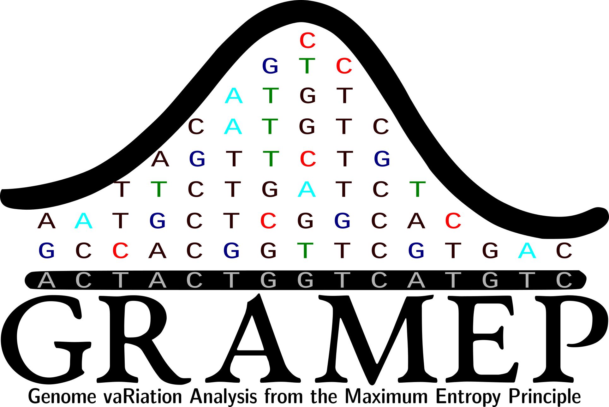

{width="500" .center}
# GRAMEP - Genome vaRiation Analysis from the Maximum Entropy Principle

**GRAMEP** is a powerful, Python-based tool designed for the precise identification of Single Nucleotide Polymorphisms (SNPs) within biological sequences.  It goes beyond basic SNP identification, offering advanced functionalities including:

* **Intersection analysis:** Analyze mutations found in different variants to identify shared mutations.
* **Classification model training:** Train a classification model to predict the class of new sequences.

GRAMEP is accessible through a robust and intuitive Command-Line Interface (CLI). The primary command is `gramep`, with sub-commands for each action the application can perform.







## Quick Guide

### Identifying the most informative SNPs

To identify the most informative Single Nucleotide Polymorphisms (SNPs) using GRAMEP, you will utilize the `get-mutations` command. Below, you will find the basic usage of this command:

<!-- termynal -->

```
$ gramep get-mutations [OPTIONS]
```

For detailed information on available options and how to use them, simply enter the following command:

<!-- termynal -->

```
$ gramep get-mutations --help
```

This will provide you with comprehensive guidance on how to make the most of the `get-mutations` command, allowing you to efficiently analyze and extract valuable SNPs from your biological sequences.



To perform the most basic analysis with the `get-mutations` command, you need to specify the parameters presented by the `--help`option.

These parameters configure the basic settings for your SNP identification analysis using the `get-mutations` command. Ensure you fulfill the required parameters and customize the optional ones to fit your specific analysis needs.


### Identifying Mutation Intersection Between Variants

To identify the intersection of mutations present in two or more variants of the same organism, you can utilize the `get-intersection`` command provided by GRAMEP. Below, we outline the basic usage of this command:

<!-- termynal -->

```
$ gramep get-intersection [OPTIONS]
```

This command allows you to analyze and find common mutations shared among multiple variant sequences. For detailed information on available options and how to make the most of the `get-intersection` command, simply use the `--help` flag:

<!-- termynal -->

```
$ gramep get-intersection --help

 Usage: gramep get-intersection [OPTIONS]                                                                                                    
                                                                                                                                             
 Get intersection between variants.                                                                                                          
                                                                                                                                             
╭─ Options ─────────────────────────────────────────────────────────────────────────────────────────────────────────────────────────────────╮
│ *  --save-path                              TEXT  📂 Folder where the results obtained through the get-mutations subcommand were saved.   │
│                                                   [default: None]                                                                         │
│                                                   [required]                                                                              │
│    --intersection-seletion  -selection      TEXT  ✔ Select intersection type. To specify the variants for intersection, provide them      │
│                                                   separated by '-'. For example: 'variant1-variant2-variant3'.                            │
│                                                   [default: ALL]                                                                          │
│    --help                                         Show this message and exit.                                                             │
╰───────────────────────────────────────────────────────────────────────────────────────────────────────────────────────────────────────────╯
```

This will provide you with comprehensive guidance on using the `get-intersection` command effectively to identify mutation intersections between variants in your genomics analysis.

To perform the most basic analysis with the `get-intersection` command, you need to specify the following parameters:

|Parameter| Type | Description|
| --------| -----| -----------|
| --save-path | Text | :open_file_folder: Folder where the results obtained through the `get-mutations` command were saved. **Is required**.|
| --intersection-seletion | Text | :heavy_check_mark: Select intersection type. To specify the variants for intersection, provide them separated by `-`. For example: 'variant1-variant2-variant3'. |

!!! warning "Multiple variants intersection"
    It's important to note that performing intersection analysis between multiple variants can be computationally intensive and time-consuming.

These parameters enable you to customize the settings for your SNP intersection analysis using the `get-intersection` command. It's important to ensure that you provide the required parameters and tailor the optional ones to align with your specific analysis requirements.

### Classifying Biological Sequences

To classify biological sequences using GRAMEP, you can utilize the `classify` command. Here is the basic usage of this command:

<!-- termynal -->

```
$ gramep classify [OPTIONS]
```

This command allows you to perform sequence classification tasks with ease. For detailed information on available options and how to use them effectively, use the `--help` flag:

<!-- termynal -->

```
$ gramep classify --help

Usage: gramep classify [OPTIONS]                                                                                                            
                                                                                                                                             
 Classify variants.                                                                                                                          
                                                                                                                                             
╭─ Options ─────────────────────────────────────────────────────────────────────────────────────────────────────────────────────────────────╮
│ *  --word              -w          INTEGER  📏 Word size. [default: None] [required]                                                      │
│ *  --step              -s          INTEGER  ⏭ Step size. [default: None] [required]                                                       │
│ *  --save-path                     TEXT     📂 Path to save results. [default: None] [required]                                           │
│ *  --dir-path          -dpath      TEXT     📂 Path to directory containing variants. [default: None] [required]                          │
│    --get-kmers                       📏 Get only k-mers.                                                                           │
│    --reference-path    -rpath      TEXT     📂 Path to reference sequence. [default: None]                                                │
│    --dictonary         -d          TEXT     🧬📖 DNA dictionary. [default: DNA]                                                           │
│    --chunk-size                    INTEGER  📦 Chunk size for loading sequences. [default: 100]                                           │
│    --help                                   Show this message and exit.                                                                   │
╰───────────────────────────────────────────────────────────────────────────────────────────────────────────────────────────────────────────╯
```

The `classify` command of GRAMEP is used to train classification model to classify biological sequences. 
These parameters provide flexibility and control over the classification process. Be sure to specify the required parameters and customize the optional ones according to your classification needs. GRAMEP will use these settings to perform biological sequence classification effectively.

### Predicting Biological Sequences

The `predict` command of GRAMEP is used to perform class predictions on new biological sequences after training a classification model. Below, you'll find the basic usage of this command:

<!-- termynal -->

```
$ gramep predict [OPTIONS]
```

This command allows you to leverage your trained classification model to predict the classes of new biological sequences. For detailed information on available options and how to use them effectively, utilize the `--help` flag:

<!-- termynal -->

```
$ gramep predict --help

 Usage: gramep predict [OPTIONS]                                                                                                             
                                                                                                                                             
 Predict variants.                                                                                                                           
                                                                                                                                             
╭─ Options ─────────────────────────────────────────────────────────────────────────────────────────────────────────────────────────────────╮
│ *  --word              -w             INTEGER  📏 Word size. [default: None] [required]                                                   │
│ *  --step              -s             INTEGER  ⏭ Step size. [default: None] [required]                                                    │
│ *  --save-path                        TEXT     📂 Path to save results. [default: None] [required]                                        │
│ *  --predict-seq-path  -pseqpath      TEXT     📂 Path to sequences to be predicted. [default: None] [required]                           │
│ *  --dir-path          -dpath         TEXT     📂 Path to directory containing the files. [default: None] [required]                      │
│ *  --dict              -d             TEXT     🧬📖 DNA dictionary. [default: None] [required]                                            │
│ *  --load-ranges-path  -lrpath        TEXT     📂 Path to ranges file. [default: None] [required]                                         │
│ *  --load-model-path   -lmpath        TEXT     📂🤖 Path to model file. [default: None] [required]                                        │
│    --chunk-size                       INTEGER  📦 Chunk size for loading sequences. [default: 100]                                        │
│    --help                                      Show this message and exit.                                                                │
╰───────────────────────────────────────────────────────────────────────────────────────────────────────────────────────────────────────────╯
```
By using the `predict` command, you can apply your trained model to make accurate class predictions on new biological sequences. 

These parameters provide essential configuration options for performing class predictions on new biological sequences using the `predict` command. Ensure you specify the required parameters and customize the optional ones as needed to apply your trained classification model effectively and generate accurate predictions.


##### Acknowledgements

* This study was financed in part by the Coordenação de Aperfeiçoamento de Pessoal de Nível Superior - Brasil (CAPES) - Finance Code 001, the Fundação Araucária, Governo do Estado do Paraná/SETI (Grant number 035/2019, 138/2021 and NAPI - Bioinformática).
* [Lucas Camacho](https://github.com/LeherLucas) for kindly providing his time and expertise in CSS injection on this documentation site.